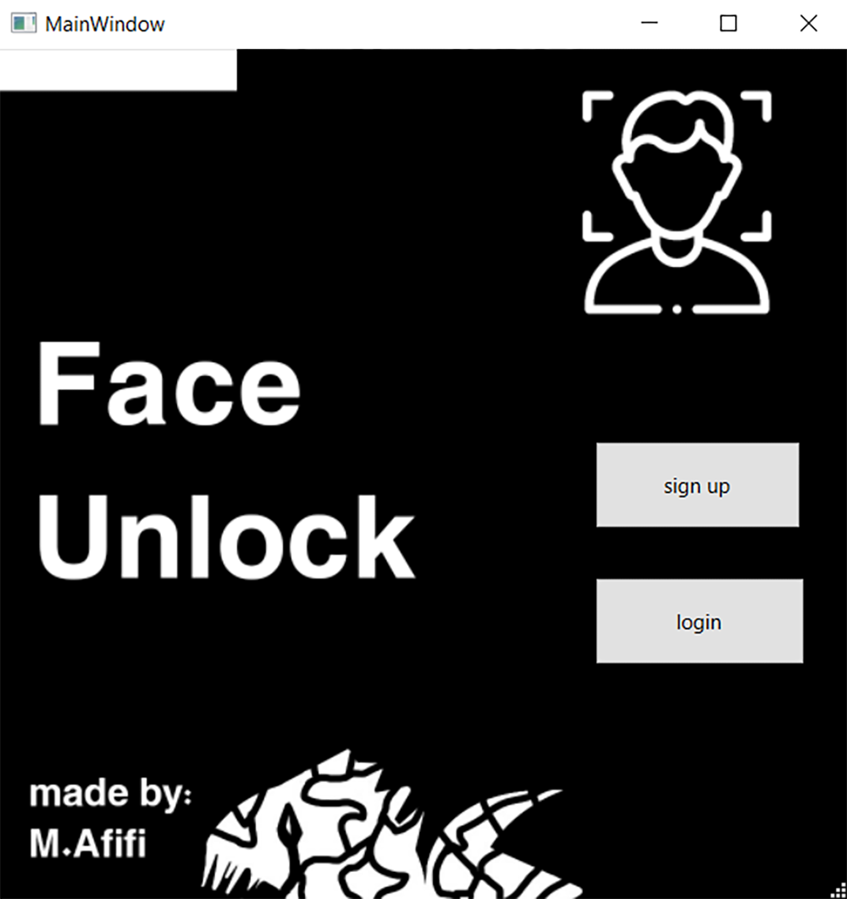
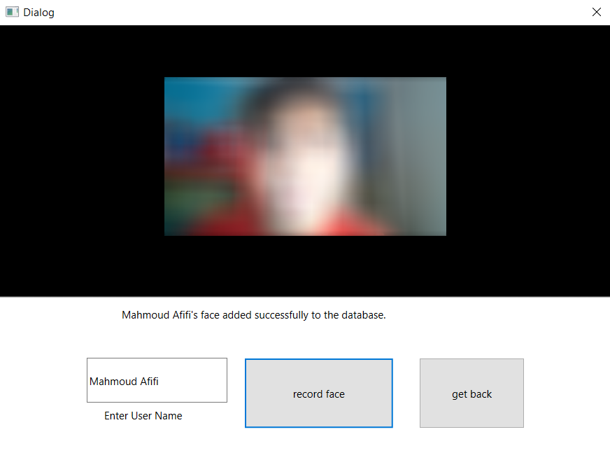
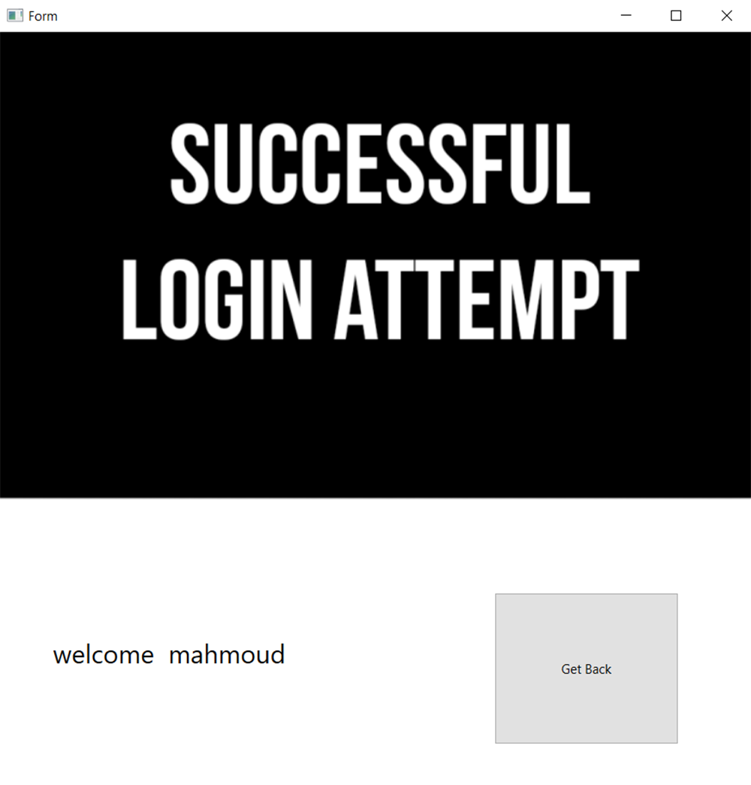
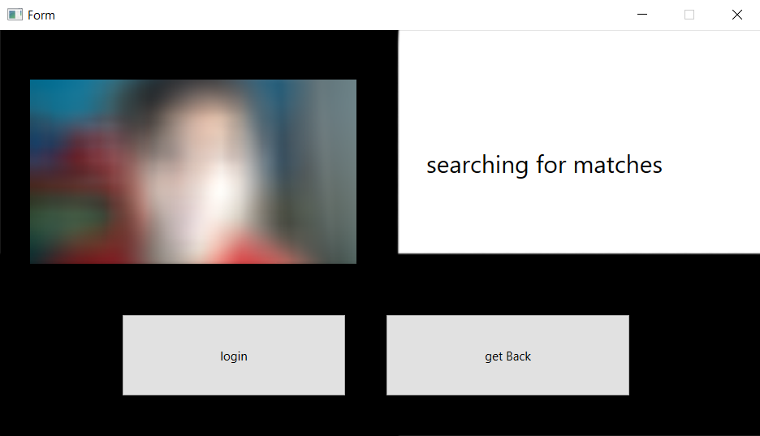
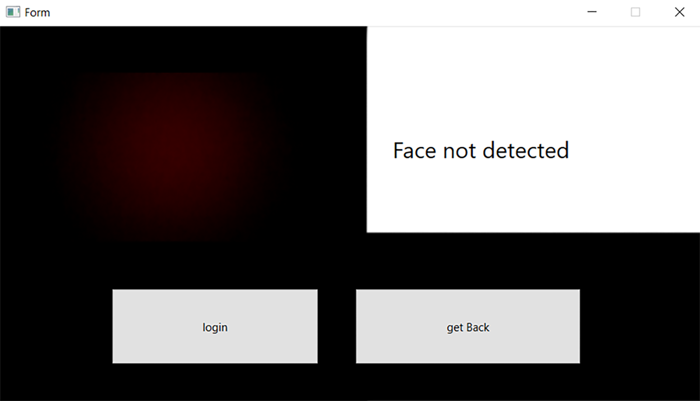

# 🔐 Face Recognition Authentication System – Qt & Python Integration

A complete, production-ready **Face Recognition Authentication System** developed using **C++ with Qt** for the GUI and **Python (TensorFlow/Keras + MediaPipe)** for the face recognition backend. The application enables seamless **user sign-up and login** experiences through facial recognition technology.

---

## 🧠 System Overview

The system consists of three core components:

- 🖥️ **Qt GUI (C++)** – Intuitive user interface with real-time camera feed and interactions.  
- 🧠 **Python Backend** – Handles face detection, embedding generation, and user matching.  
- 📊 **CSV Embedding Database** – Stores normalized 512D embeddings linked to usernames.

---

## ✨ Key Features

- 🧍‍♂️ **User Registration & Login via Face Recognition**  
  Real-time facial recognition for secure user login and registration.

- 🎥 **Real-Time Camera Preview**  
  Smooth and responsive camera interaction for both registration and authentication.

- 🔒 **Secure Face Embedding Storage**  
  Efficient CSV-based storage of user face embeddings, ensuring privacy and scalability.

- 💻 **Cross-Language Integration**  
  Qt C++ frontend interacts seamlessly with Python backend via `QProcess`, ensuring smooth face recognition operations.

- 🔍 **FaceNet-Based Embeddings**  
  Utilizes pre-trained FaceNet model for generating 512-dimensional face embeddings for accurate identification.

---

## 🔧 Core Components

### User Registration
- **Purpose**: Capture user face data and store face embeddings linked to a username.
- **Features**: 
  - Real-time camera preview
  - Face capture via "Record Face" button
  - Embedding generation and storage in CSV database

### User Authentication
- **Purpose**: Authenticate users by matching captured faces with registered embeddings.
- **Features**: 
  - Real-time camera preview
  - Face capture and similarity scoring against embeddings

### Success Screen
- **Purpose**: Display a personalized message upon successful authentication.
- **Features**: 
  - Personalized greeting message
  - Option to return to the main screen

### Python Backend
- **Technologies**: 
  - **MediaPipe** for face detection and alignment
  - **FaceNet** (Keras) for generating face embeddings
  - **TensorFlow** for deep learning operations
  - **Pandas** for managing user embedding database
- **Key Scripts**: 
  - **newEmbedding.py**: Handles face detection, embedding generation, and database management.
  - **findMatch.py**: Performs face matching with stored embeddings and returns similarity scores.

---

## 💾 Data Management

### 📂 CSV Database
- **Format**: `name`, `embedding`
  - **name**: User identifier
  - **embedding**: Space-separated 512D float values
- **Location**: Default: `users_database.csv` in the application directory

---

## 🧪 Performance

- **Face Matching**:  
  - **Threshold**: 0.55 similarity score for a match.
  - Efficient matching using cosine similarity between face embeddings.

- **Camera Preview**:  
  - Uses Qt's multimedia framework for smooth camera feed.

---

## 📸 Screenshots

- **Screenshot 1**: Main Menu – The initial screen of the application, allowing the user to choose between signing up or logging in.

- **Screenshot 2**: Signing Up – The user registration screen where users can capture their face data to create a new account.

- **Screenshot 3**: Successful Login – A screen shown after a successful authentication, displaying a personalized welcome message.

- **Screenshot 4**: Login and Searching for Matches – The user authentication process in action, where the system searches for matching face embeddings.

- **Screenshot 5**: No Face Detected – The system shows this screen when no face is detected during the authentication attempt.

---

## 📬 Contact

For questions, feedback, or contributions, feel free to reach out:

📧 **mahmoudhossam@aucegypt.edu**

---
